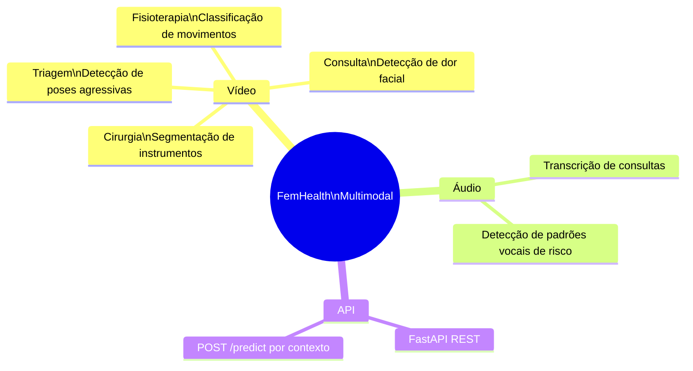
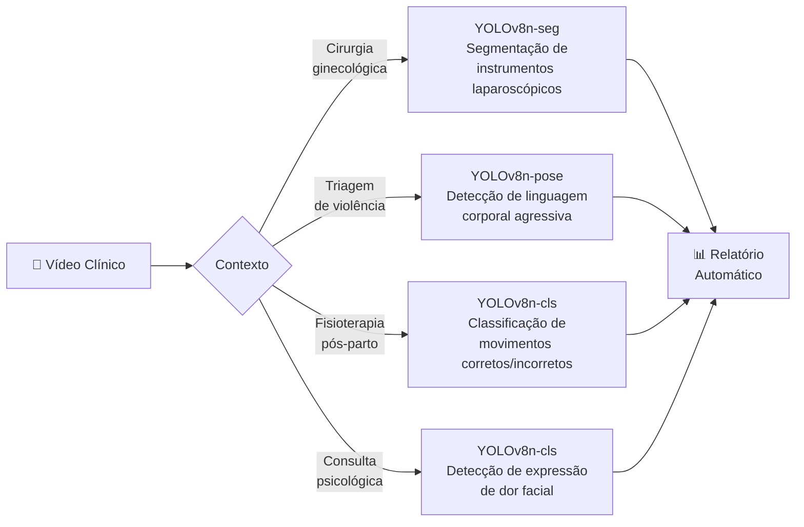
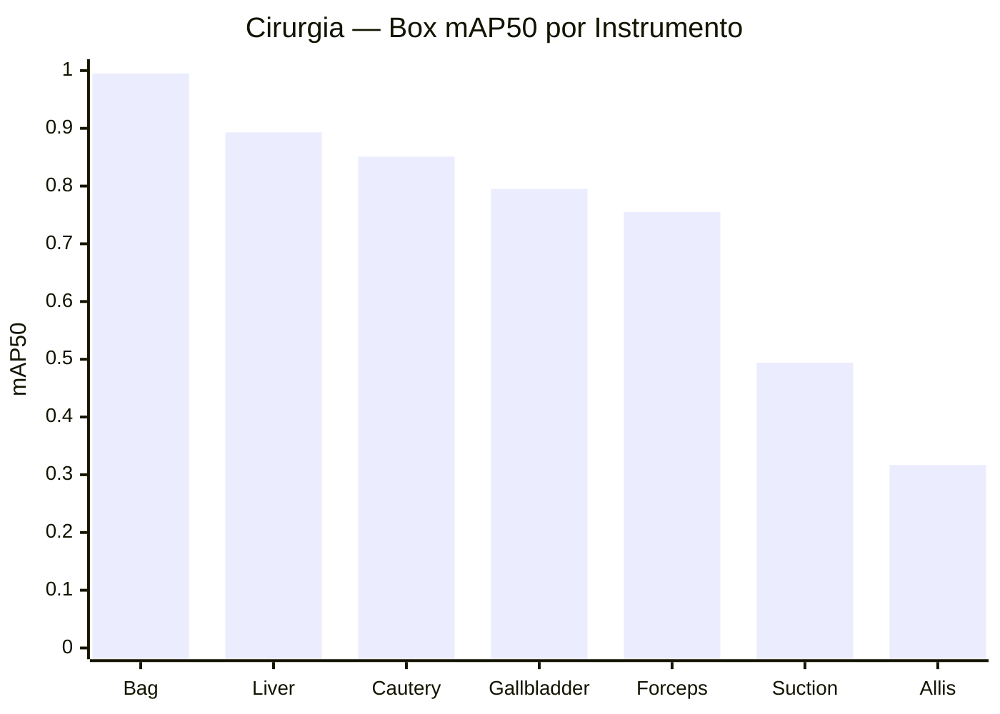
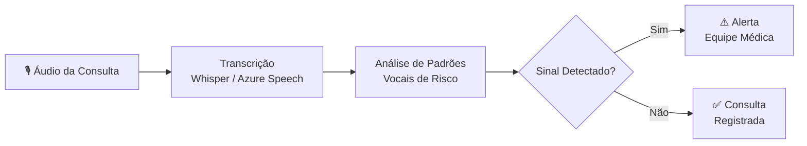
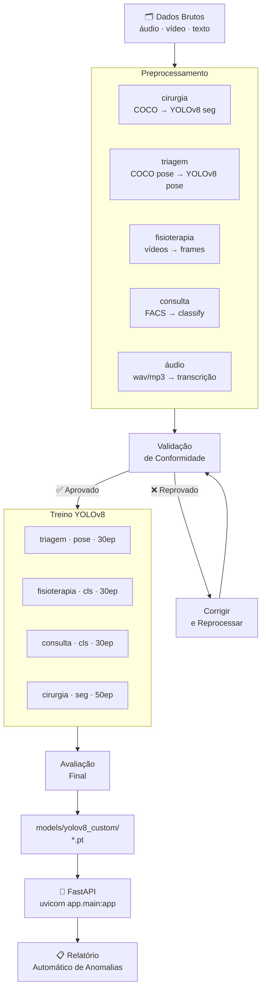
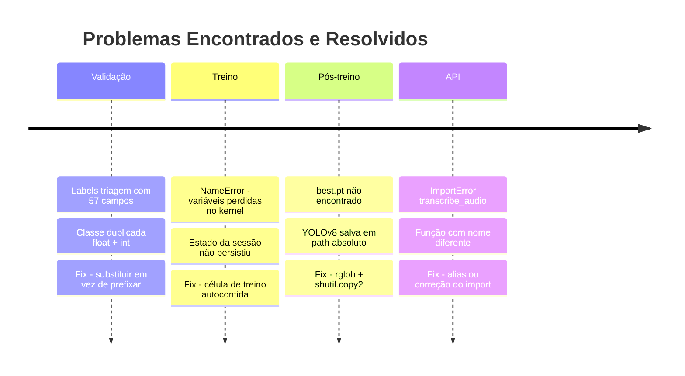
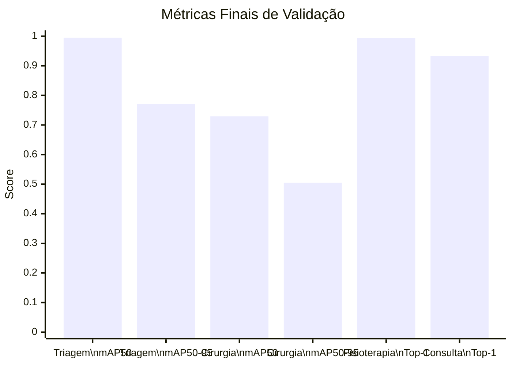
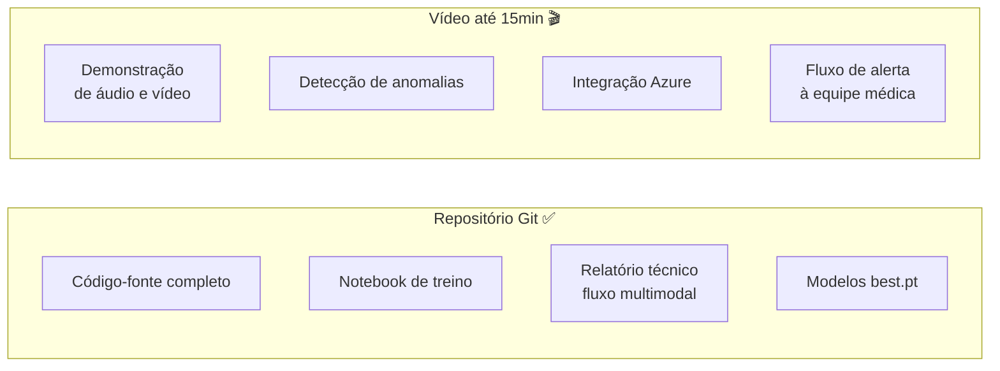

# 🏥 FemHealth — Roteiro de Apresentação
### Tech Challenge Fase 4 · POSTECH IADT · FIAP · Março/2026

---

## 1. O Desafio

A rede hospitalar FemHealth precisa monitorar pacientes continuamente por meio de
**dados multimodais — áudio, vídeo e texto** — para identificar sinais precoces de
risco específicos da saúde e segurança feminina.

Nossa solução cobre **três dos objetivos obrigatórios**:

- ✅ Detectar precocemente riscos em saúde materna e ginecológica
- ✅ Identificar sinais de violência doméstica ou abuso
- ✅ Monitorar bem-estar psicológico feminino

---

## 2. Visão Geral da Solução

---

## 3. Requisito 1 — Análise de Vídeo Especializada

O documento exige processamento de vídeos clínicos em 4 contextos.
Implementamos todos com **YOLOv8 customizado**:

### 3.1 Modelo Especializado — Instrumentos Cirúrgicos Ginecológicos

Atende diretamente ao requisito:
> *"YOLOv8 customizado para detecção de instrumentos cirúrgicos ginecológicos"*

Dataset: **Laparoscopia Roboflow** · 1081 imagens · 7 classes

> ⚠️ `Allis` e `Suction` com mAP50 baixo por underrepresentation no val —
> limitação do dataset, não do modelo.

### 3.2 Triagem de Violência — Linguagem Corporal

Atende ao requisito:
> *"Triagem de violência: detecção de linguagem corporal indicativa de abuso"*

Dataset: **Aggressive Poses** · 103 imagens · 17 keypoints

| Métrica | Box | Pose |
|---------|-----|------|
| Precision | 0.998 | 0.998 |
| Recall | **1.000** | **1.000** |
| mAP50 | 0.995 | 0.995 |
| mAP50-95 | 0.956 | 0.771 |

> Recall perfeito — **nenhuma pose de risco deixa de ser detectada.**

### 3.3 Fisioterapia Pós-parto — Análise de Movimentos

Atende ao requisito:
> *"Fisioterapia: análise de movimentos e recuperação"*

Dataset: **678 vídeos → 3019 frames** · 6 classes (Arm Raise, Knee Extension, Sit To Stand · correto/incorreto)

| Métrica | Valor |
|---------|-------|
| Top-1 Accuracy | **0.994** |
| Top-5 Accuracy | 1.000 |
| Inferência | 0.9ms/img |

### 3.4 Consulta — Sinais Não-verbais de Desconforto

Atende ao requisito:
> *"Consultas: identificação de sinais não-verbais de desconforto ou medo"*

Dataset: **UNBC-McMaster Pain (FACS)** · 4000 imagens balanceadas · 2 classes

| Métrica | Valor |
|---------|-------|
| Top-1 Accuracy | **0.933** |
| Top-5 Accuracy | 1.000 |

---

## 4. Requisito 2 — Análise de Áudio

Atende ao requisito:
> *"Processar gravações de voz de pacientes em consultas"*

> Módulo `app/audio/transcriber.py` — integração em finalização.

---

## 5. Pipeline Técnico Completo

---

## 6. Desafios Técnicos e Soluções

---

## 7. Resultados Consolidados

---

## 8. Entregáveis — Checklist

| Entregável | Status |
|------------|--------|
| Código-fonte completo | ✅ |
| Análise de vídeo (4 contextos) | ✅ |
| Modelos YOLOv8 customizados | ✅ |
| Análise de áudio | 🔧 Em finalização |
| FastAPI REST | 🔧 Em finalização |
| Relatórios automáticos | 🔧 Em finalização |
| Vídeo demonstração (YouTube/Vimeo) | ⏳ Pendente |

---

## 9. Melhorias Futuras

- **Cirurgia:** Ampliar instâncias de `Allis` e `Suction` com data augmentation
- **Triagem:** Adicionar `flip_idx` no `data.yaml` e ampliar dataset para 500+ imagens
- **Áudio:** Integrar Azure Cognitive Services / Speech-to-Text para análise vocal em tempo real
- **Deploy:** Exportar modelos para ONNX e containerizar com Docker

---

*Tech Challenge Fase 4 · POSTECH IADT · FIAP · Março/2026*
